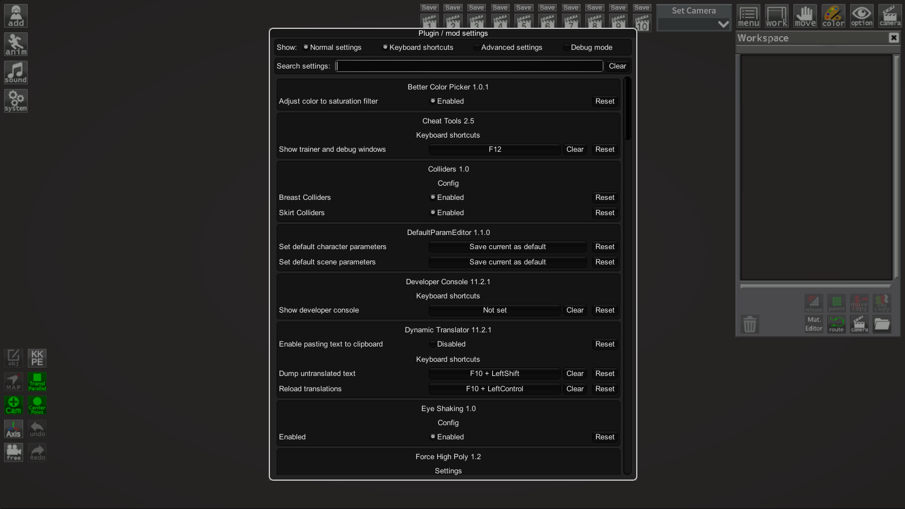

## Plugin / mod configuration manager for BepInEx 5
An easy way to let user configure how a plugin behaves without the need to make your own GUI. The user can change any of the settings you expose, even keyboard shortcuts.

The configuration manager can be accessed in-game by pressing the hotkey (by default F1). Hover over the setting names to see their descriptions, if any.



## How to use
- Install BepInEx v5.4.20 or newer (older v5 versions won't work, v6 won't work either without a compatibility layer).
- Download latest release from the Releases tab above.
- Place the .dll inside your BepInEx\Plugins folder.
- Start the game and press F1.

Note: The .xml file is useful for plugin developers when referencing ConfigurationManager.dll in your plugin, it will provide descriptions for types and methods to your IDE. Users can ignore it.

## How to make my mod compatible?
ConfigurationManager will automatically display all settings from your plugin's `Config`. All metadata (e.g. description, value range) will be used by ConfigurationManager to display the settings to the user.

In most cases you don't have to reference ConfigurationManager.dll or do anything special with your settings. Simply make sure to add as much metadata as possible (doing so will help all users, even if they use the config files directly). Always add descriptive section and key names, descriptions, and acceptable value lists or ranges (wherever applicable).

### How to make my setting into a slider?
Specify `AcceptableValueRange` when creating your setting. If the range is 0f - 1f or 0 - 100 the slider will be shown as % (this can be overridden below).
```c#
CaptureWidth = Config.Bind("Section", "Key", 1, new ConfigDescription("Description", new AcceptableValueRange<int>(0, 100)));
```

### How to make my setting into a drop-down list?
Specify `AcceptableValueList` when creating your setting. If you use an enum you don't need to specify AcceptableValueList, all of the enum values will be shown. If you want to hide some values, you will have to use the attribute.

Note: You can add `System.ComponentModel.DescriptionAttribute` to your enum's items to override their displayed names. For example:
```c#
public enum MyEnum
{
    // Entry1 will be shown in the combo box as Entry1
    Entry1,
    [Description("Entry2 will be shown in the combo box as this string")]
    Entry2
}
```

### How to allow user to change my keyboard shorcuts / How to easily check for key presses?
Add a setting of type KeyboardShortcut. Use the value of this setting to check for inputs (recommend using IsDown) inside of your Update method.

The KeyboardShortcut class supports modifier keys - Shift, Control and Alt. They are properly handled, preventing common problems like K+Shift+Control triggering K+Shift when it shouldn't have.
```c#
private ConfigEntry<KeyboardShortcut> ShowCounter { get; set; }

public Constructor()
{
    ShowCounter = Config.Bind("Hotkeys", "Show FPS counter", new KeyboardShortcut(KeyCode.U, KeyCode.LeftShift));
}

private void Update()
{
    if (ShowCounter.Value.IsDown())
    {
        // Handle the key press
    }
}
```

## Overriding default Configuration Manager behavior
You can change how a setting is shown inside the configuration manager window by passing an instance of a special class as a tag of the setting. The special class code can be downloaded [here](ConfigurationManagerAttributes.cs). Simply download the .cs file and drag it into your project.
- You do not have to reference ConfigurationManager.dll for this to work.
- The class will work as long as name of the class and declarations of its fields remain unchanged. 
- Avoid making the class public to prevent conflicts with other plugins. If you want to share it between your plugins either give each a copy, or move it to your custom namespace.
- If the ConfigurationManager plugin is not installed in the game, this class will be safely ignored and your plugin will work as normal.

Here's an example of overriding order of settings and marking one of the settings as advanced:
```c#
// Override IsAdvanced and Order
Config.Bind("X", "1", 1, new ConfigDescription("", null, new ConfigurationManagerAttributes { IsAdvanced = true, Order = 3 }));
// Override only Order, IsAdvanced stays as the default value assigned by ConfigManager
Config.Bind("X", "2", 2, new ConfigDescription("", null, new ConfigurationManagerAttributes { Order = 1 }));
Config.Bind("X", "3", 3, new ConfigDescription("", null, new ConfigurationManagerAttributes { Order = 2 }));
```

### How to make a custom editor for my setting?
If you are using a setting type that is not supported by ConfigurationManager, you can add a drawer Action for it. The Action will be executed inside OnGUI, use GUILayout to draw your setting as shown in the example below.

To use a custom seting drawer for an individual setting, use the `CustomDrawer` field in the attribute class. See above for more info on the attribute class.
```c#
void Start()
{
    // Add the drawer as a tag to this setting.
    Config.Bind("Section", "Key", "Some value" 
        new ConfigDescription("Desc", null, new ConfigurationManagerAttributes{ CustomDrawer = MyDrawer });
}

static void MyDrawer(BepInEx.Configuration.ConfigEntryBase entry)
{
    // Make sure to use GUILayout.ExpandWidth(true) to use all available space
    GUILayout.Label(entry.BoxedValue, GUILayout.ExpandWidth(true));
}
```
#### Add a custom editor globally
You can specify a drawer for all settings of a setting type. Do this by using `ConfigurationManager.RegisterCustomSettingDrawer(Type, Action<SettingEntryBase>)`.

**Warning:** This requires you to reference ConfigurationManager.dll in your project and is not recommended unless you are sure all users will have it installed. It's usually better to use the above method to add the custom drawer to each setting individually instead.
```c#
void Start()
{
    ConfigurationManager.RegisterCustomSettingDrawer(typeof(MyType), CustomDrawer);
}

static void CustomDrawer(SettingEntryBase entry)
{
    GUILayout.Label((MyType)entry.Get(), GUILayout.ExpandWidth(true));
}
```
